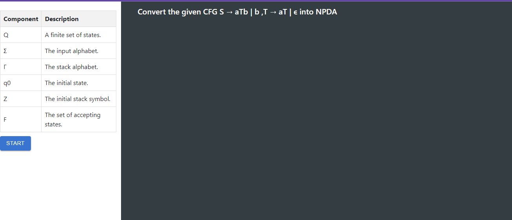
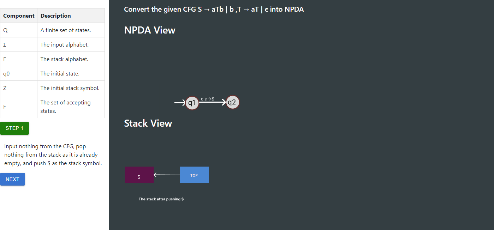
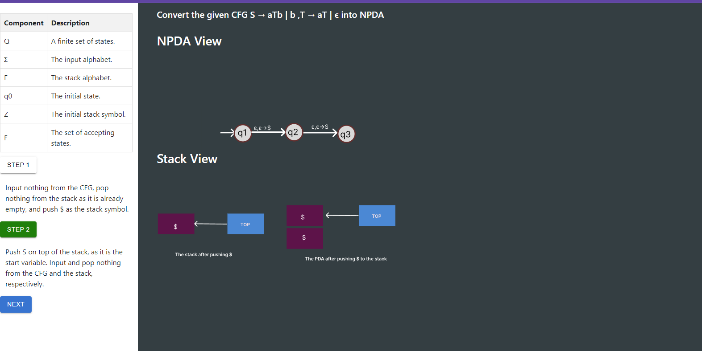
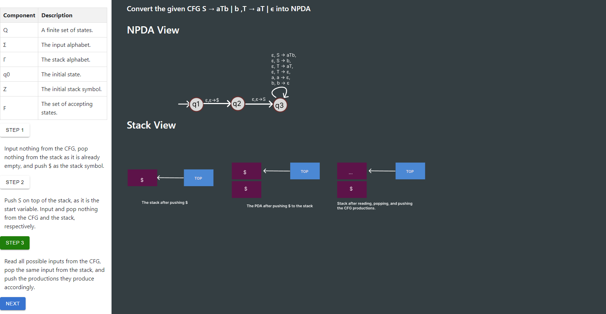
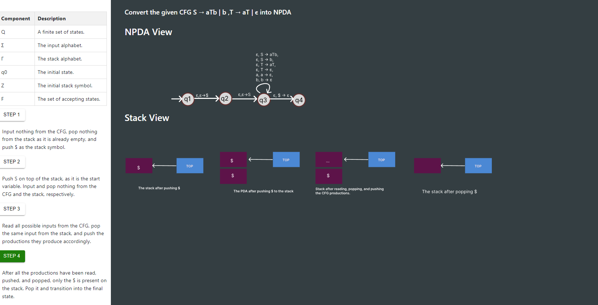

<u><h3>Procedure</u></h3>

Observe the given table with components and corresponding description 

To  convert the given CFG S → aTb | b ,T → aT | ϵ into NPDA follow the steps given below 

click on the start button to start the simulation

<b>Step 1:</b> Push $ as the stack symbol

<b>Step 2:</b> Push 'S'

<b>Step 3:</b> Self-loop state

<b>Step 4 :</b>Pop $ 

<!-- 

 -->