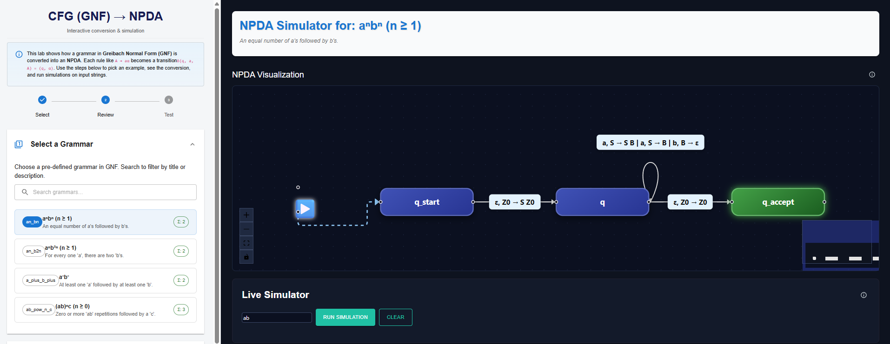
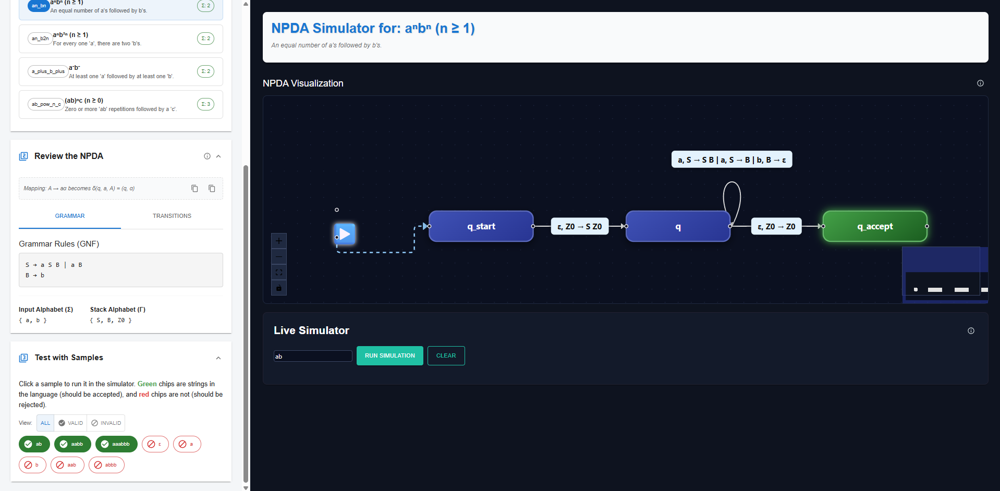
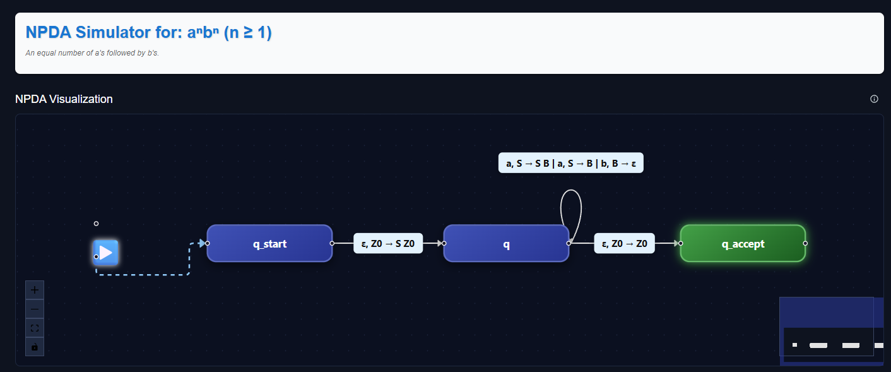
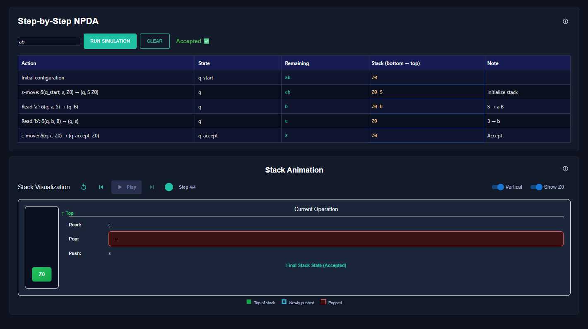

#### Step 1 — Select Grammar
- Click the Start button to begin the simulation.
- Choose the predefined grammar from the list.

#### Step 2 — View the NPDA and Test with Samples
- Review the NPDA details on the left under “Review the NPDA.”
- Test with sample inputs under the “Test with Samples” section.

#### Step 3 — View the selected grammar NPDA visualization
- Scroll to the NPDA Visualization section to see the state diagram.
- Use the zoom and pan controls to explore the graph.
- Inspect start/accept states and ε-transitions to understand how the NPDA processes inputs.

#### Step 4 — Step-by-Step NPDA (Run and Stack Visualization)
- Enter an input (e.g., ab) and click Run Simulation.
- Use Play to auto-run or Step to move through each configuration.
- Watch the table as you step:
  - Action (transition taken)
  - State (current state)
  - Remaining (unread input)
  - Stack (bottom → top)
  - Note (rule/explanation)
- In Stack Animation, observe pushes/pops and confirm acceptance on the final step.

